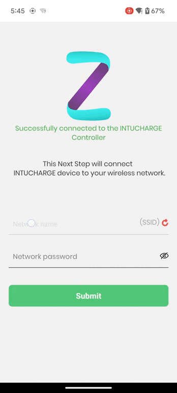

## React Native IoT Device Onboarding

## Introduction:

- React Native IoT Device Onboarding Module component helps you with the Onboarding of the IoT device using the WiFi network
  You can directly use this in your react native project by following the below steps

## Description:
- This Component can be used to extend your application with IoT device's onboarding support using the mobile application and Wi-Fi connectivity, this app uses wifi to onboard your IoT device.

- You can just simply navigate to the project and follow the steps and then add the necessary things to your code and it will  help onboard your IoT device using React Native Mobile Application.

- This application uses the local network and address of 192.168.4.1 as the default address to use the ioT device server and communicate with that, you can change it as per your requirement and also the APIs as per your firmware usage.

## Prerequisite tools

1. React-Native: React Native 0.70.6
2. Npm | Yarn : use NPM or YARN for package and library management

**Getting started :**

1. Install all NPM packages by using following command

   - npm i | yarn
   - Define the important dependent package with version
     - native-base - ^3.4.25
     - react-query: 3.39.2
     - react-redux - ^8.0.5
     - react-native-mmkv - ^2.5.1

2. Manage the environment of the App from .env files (stage, prod)

3. Run YARN or npm i command for install the package

   - npm i or yarn

4. Go through the package.json file and check the scripts for command regarding:

   - Pod-install
   - Android build clean
   - iOS build clean
   - release android build
   - generate icons
   - post install
   - bundle the Android package
   - bundle the iOS package

5. Use of this repo:
   - First follow the Tutorial pager and modify the code according to your need
   - Change the API endpoints and also manage the local API client to connect with the desired device with static base URL/address (default set to: 192.168.4.1)
   - Also change the remote url address with your server and then use that for remote data fetching
   - This code works with the Provisional state of the device so modify the state handling as per firmware
   - This module shares the Network credentials over Wi-Fi and then as per the state of the device after sharing the creds. app redirects the user to the respected screen -> If success then success screen or else failure screen
   - Use the Tutorial, Configure screen and Success or Failure screen from the code according to your need and ignore the rest files because that have the configurations as per requirement and some remote data fetching configurations also present there

# Bugs and Feedback
For bugs, questions and discussions please use the Github Issues.

# License

Copyright (c) 2024 Intuz Solutions Pvt Ltd.

Permission is hereby granted, free of charge, to any person obtaining a copy of this software and associated documentation files (the "Software"), to deal in the Software without restriction, including without limitation the rights to use, copy, modify, merge, publish, distribute, sublicense, and/or sell copies of the Software, and to permit persons to whom the Software is furnished to do so, subject to the following conditions:

THE SOFTWARE IS PROVIDED "AS IS", WITHOUT WARRANTY OF ANY KIND, EXPRESS OR IMPLIED, INCLUDING BUT NOT LIMITED TO THE WARRANTIES OF MERCHANTABILITY, FITNESS FOR A PARTICULAR PURPOSE AND NONINFRINGEMENT. IN NO EVENT SHALL THE AUTHORS OR COPYRIGHT HOLDERS BE LIABLE FOR ANY CLAIM, DAMAGES OR OTHER LIABILITY, WHETHER IN AN ACTION OF CONTRACT, TORT OR OTHERWISE, ARISING FROM, OUT OF OR IN CONNECTION WITH THE SOFTWARE OR THE USE OR OTHER DEALINGS IN THE SOFTWARE.

